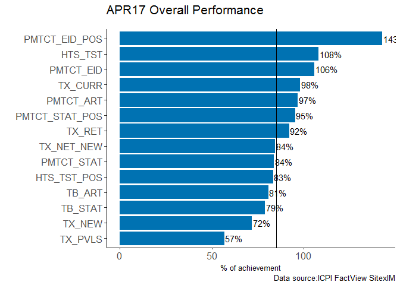
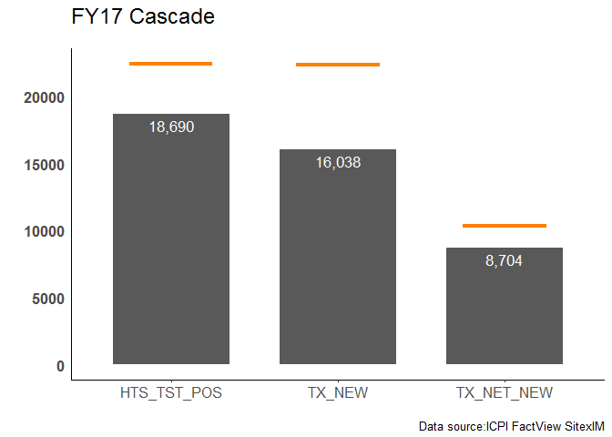
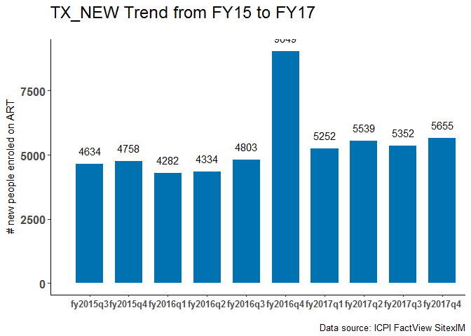
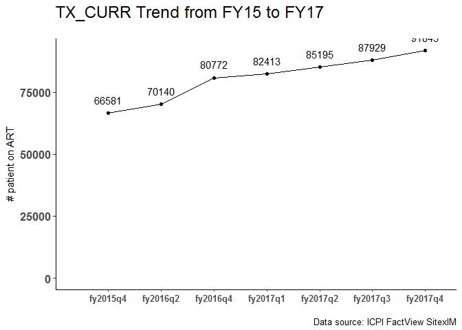
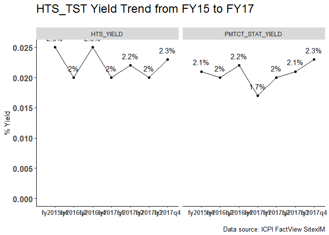
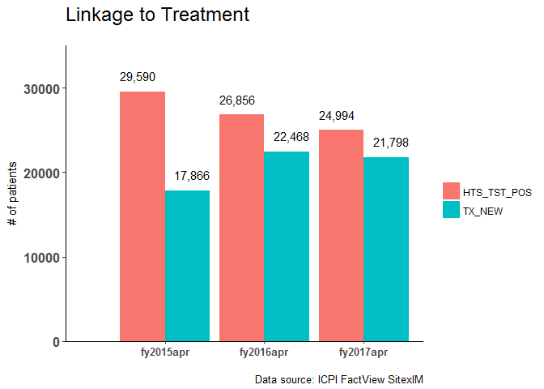

Operating Unit Level (OU Level)
================

Overall Achievement (OU Level)
------------------------------

This table shows orverall achievement of the country from FY15 to FY17

<table class="table table-striped table-hover table-condensed table-responsive" style="font-size: 12px; width: auto !important; float: right; margin-left: 10px;">
<thead>
<tr>
<th style="text-align:left;">
indicator
</th>
<th style="text-align:right;">
fy2015apr
</th>
<th style="text-align:right;">
fy2016apr
</th>
<th style="text-align:right;">
fy2017q1
</th>
<th style="text-align:right;">
fy2017q2
</th>
<th style="text-align:right;">
fy2017q3
</th>
<th style="text-align:right;">
fy2017q4
</th>
<th style="text-align:right;">
fy2017\_targets
</th>
<th style="text-align:right;">
fy2017Cum
</th>
<th style="text-align:right;">
fy2017Perf
</th>
</tr>
</thead>
<tbody>
<tr>
<td style="text-align:left;">
OVC\_HIVSTAT
</td>
<td style="text-align:right;">
0
</td>
<td style="text-align:right;">
0
</td>
<td style="text-align:right;">
0
</td>
<td style="text-align:right;">
19754
</td>
<td style="text-align:right;">
0
</td>
<td style="text-align:right;">
4332
</td>
<td style="text-align:right;">
0
</td>
<td style="text-align:right;">
4332
</td>
<td style="text-align:right;">
0.0
</td>
</tr>
<tr>
<td style="text-align:left;">
OVC\_SERV
</td>
<td style="text-align:right;">
19115
</td>
<td style="text-align:right;">
18486
</td>
<td style="text-align:right;">
0
</td>
<td style="text-align:right;">
16466
</td>
<td style="text-align:right;">
0
</td>
<td style="text-align:right;">
15293
</td>
<td style="text-align:right;">
24835
</td>
<td style="text-align:right;">
15293
</td>
<td style="text-align:right;">
61.6
</td>
</tr>
<tr>
<td style="text-align:left;">
TX\_CURR
</td>
<td style="text-align:right;">
58189
</td>
<td style="text-align:right;">
69530
</td>
<td style="text-align:right;">
69923
</td>
<td style="text-align:right;">
72139
</td>
<td style="text-align:right;">
73649
</td>
<td style="text-align:right;">
78234
</td>
<td style="text-align:right;">
79830
</td>
<td style="text-align:right;">
78234
</td>
<td style="text-align:right;">
98.0
</td>
</tr>
<tr>
<td style="text-align:left;">
TX\_PVLS
</td>
<td style="text-align:right;">
0
</td>
<td style="text-align:right;">
0
</td>
<td style="text-align:right;">
0
</td>
<td style="text-align:right;">
0
</td>
<td style="text-align:right;">
0
</td>
<td style="text-align:right;">
34038
</td>
<td style="text-align:right;">
59875
</td>
<td style="text-align:right;">
34038
</td>
<td style="text-align:right;">
56.8
</td>
</tr>
<tr>
<td style="text-align:left;">
TX\_RET
</td>
<td style="text-align:right;">
11635
</td>
<td style="text-align:right;">
10008
</td>
<td style="text-align:right;">
0
</td>
<td style="text-align:right;">
0
</td>
<td style="text-align:right;">
0
</td>
<td style="text-align:right;">
12368
</td>
<td style="text-align:right;">
13424
</td>
<td style="text-align:right;">
12368
</td>
<td style="text-align:right;">
92.1
</td>
</tr>
<tr>
<td style="text-align:left;">
HTS\_TST
</td>
<td style="text-align:right;">
869221
</td>
<td style="text-align:right;">
945192
</td>
<td style="text-align:right;">
200843
</td>
<td style="text-align:right;">
213511
</td>
<td style="text-align:right;">
233602
</td>
<td style="text-align:right;">
216194
</td>
<td style="text-align:right;">
800169
</td>
<td style="text-align:right;">
864150
</td>
<td style="text-align:right;">
108.0
</td>
</tr>
<tr>
<td style="text-align:left;">
HTS\_TST\_POS
</td>
<td style="text-align:right;">
22810
</td>
<td style="text-align:right;">
20079
</td>
<td style="text-align:right;">
4152
</td>
<td style="text-align:right;">
4786
</td>
<td style="text-align:right;">
4605
</td>
<td style="text-align:right;">
5147
</td>
<td style="text-align:right;">
22418
</td>
<td style="text-align:right;">
18690
</td>
<td style="text-align:right;">
83.4
</td>
</tr>
<tr>
<td style="text-align:left;">
PMTCT\_ART
</td>
<td style="text-align:right;">
3747
</td>
<td style="text-align:right;">
3286
</td>
<td style="text-align:right;">
645
</td>
<td style="text-align:right;">
818
</td>
<td style="text-align:right;">
919
</td>
<td style="text-align:right;">
861
</td>
<td style="text-align:right;">
3355
</td>
<td style="text-align:right;">
3243
</td>
<td style="text-align:right;">
96.7
</td>
</tr>
<tr>
<td style="text-align:left;">
PMTCT\_EID
</td>
<td style="text-align:right;">
3110
</td>
<td style="text-align:right;">
3189
</td>
<td style="text-align:right;">
792
</td>
<td style="text-align:right;">
879
</td>
<td style="text-align:right;">
790
</td>
<td style="text-align:right;">
915
</td>
<td style="text-align:right;">
3193
</td>
<td style="text-align:right;">
3376
</td>
<td style="text-align:right;">
105.7
</td>
</tr>
<tr>
<td style="text-align:left;">
PMTCT\_EID\_POS
</td>
<td style="text-align:right;">
260
</td>
<td style="text-align:right;">
169
</td>
<td style="text-align:right;">
55
</td>
<td style="text-align:right;">
34
</td>
<td style="text-align:right;">
51
</td>
<td style="text-align:right;">
54
</td>
<td style="text-align:right;">
136
</td>
<td style="text-align:right;">
194
</td>
<td style="text-align:right;">
142.6
</td>
</tr>
<tr>
<td style="text-align:left;">
PMTCT\_STAT
</td>
<td style="text-align:right;">
153087
</td>
<td style="text-align:right;">
147709
</td>
<td style="text-align:right;">
32814
</td>
<td style="text-align:right;">
34604
</td>
<td style="text-align:right;">
39880
</td>
<td style="text-align:right;">
33299
</td>
<td style="text-align:right;">
167663
</td>
<td style="text-align:right;">
140597
</td>
<td style="text-align:right;">
83.9
</td>
</tr>
<tr>
<td style="text-align:left;">
PMTCT\_STAT\_POS
</td>
<td style="text-align:right;">
3771
</td>
<td style="text-align:right;">
3452
</td>
<td style="text-align:right;">
586
</td>
<td style="text-align:right;">
831
</td>
<td style="text-align:right;">
925
</td>
<td style="text-align:right;">
886
</td>
<td style="text-align:right;">
3386
</td>
<td style="text-align:right;">
3228
</td>
<td style="text-align:right;">
95.3
</td>
</tr>
<tr>
<td style="text-align:left;">
TB\_ART
</td>
<td style="text-align:right;">
1146
</td>
<td style="text-align:right;">
1028
</td>
<td style="text-align:right;">
0
</td>
<td style="text-align:right;">
734
</td>
<td style="text-align:right;">
0
</td>
<td style="text-align:right;">
594
</td>
<td style="text-align:right;">
1645
</td>
<td style="text-align:right;">
1328
</td>
<td style="text-align:right;">
80.7
</td>
</tr>
<tr>
<td style="text-align:left;">
TB\_STAT
</td>
<td style="text-align:right;">
9390
</td>
<td style="text-align:right;">
9328
</td>
<td style="text-align:right;">
0
</td>
<td style="text-align:right;">
4648
</td>
<td style="text-align:right;">
0
</td>
<td style="text-align:right;">
4227
</td>
<td style="text-align:right;">
11232
</td>
<td style="text-align:right;">
8875
</td>
<td style="text-align:right;">
79.0
</td>
</tr>
<tr>
<td style="text-align:left;">
TB\_STAT\_POS
</td>
<td style="text-align:right;">
1335
</td>
<td style="text-align:right;">
1381
</td>
<td style="text-align:right;">
0
</td>
<td style="text-align:right;">
828
</td>
<td style="text-align:right;">
0
</td>
<td style="text-align:right;">
763
</td>
<td style="text-align:right;">
0
</td>
<td style="text-align:right;">
1591
</td>
<td style="text-align:right;">
0.0
</td>
</tr>
<tr>
<td style="text-align:left;">
TX\_NEW
</td>
<td style="text-align:right;">
14556
</td>
<td style="text-align:right;">
17784
</td>
<td style="text-align:right;">
3958
</td>
<td style="text-align:right;">
3882
</td>
<td style="text-align:right;">
3847
</td>
<td style="text-align:right;">
4351
</td>
<td style="text-align:right;">
22300
</td>
<td style="text-align:right;">
16038
</td>
<td style="text-align:right;">
71.9
</td>
</tr>
<tr>
<td style="text-align:left;">
TX\_NET\_NEW
</td>
<td style="text-align:right;">
0
</td>
<td style="text-align:right;">
11341
</td>
<td style="text-align:right;">
393
</td>
<td style="text-align:right;">
2216
</td>
<td style="text-align:right;">
1510
</td>
<td style="text-align:right;">
4585
</td>
<td style="text-align:right;">
10300
</td>
<td style="text-align:right;">
8704
</td>
<td style="text-align:right;">
84.5
</td>
</tr>
</tbody>
</table>
Overall Indicator achievement
-----------------------------

Cascade FY17
------------

TX\_NEW Trend
-------------

TX\_CURR Trend
--------------

HTS and PMTCT\_STAT yield
-------------------------

Linkage to Treatment
--------------------

